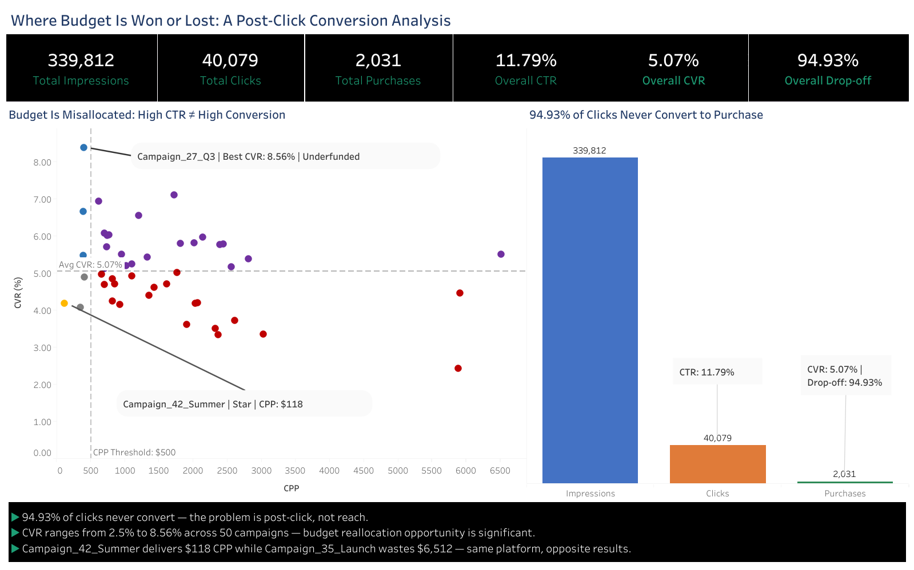
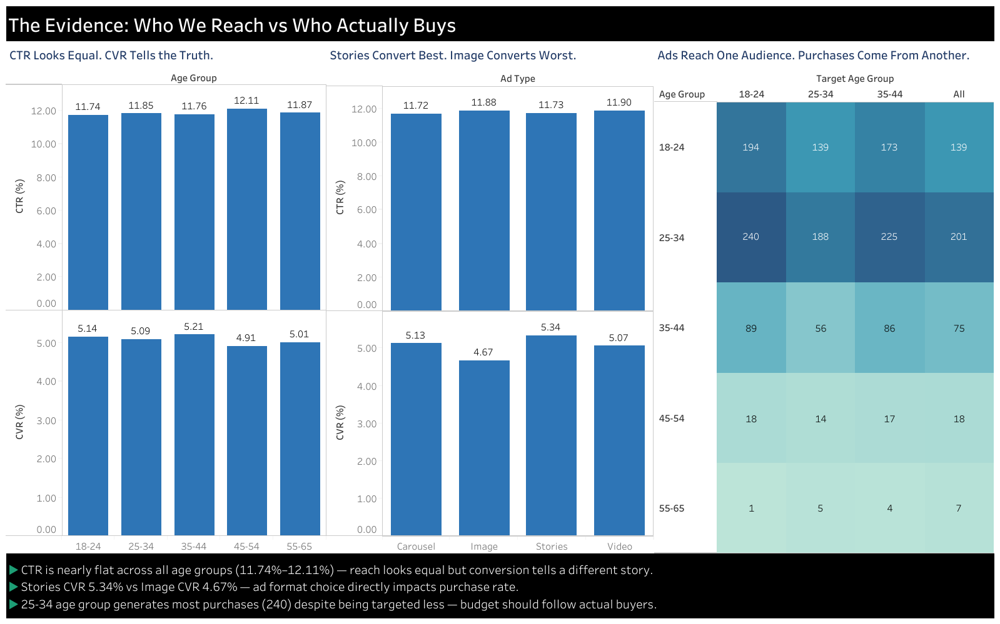
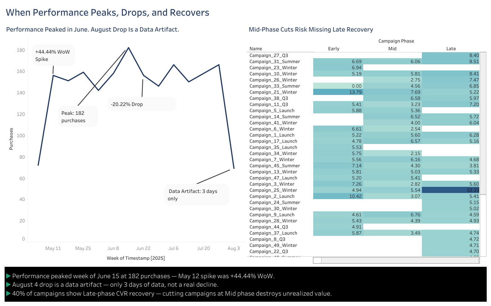

# Marketing Campaign Tableau Dashboard

## Where Budget Is Won or Lost: A Post-Click Conversion Analysis

An interactive 3-dashboard Tableau workbook presenting the findings of a completed MySQL marketing campaign analysis. The central argument: CTR is a vanity metric — post-click conversion rate and cost per purchase are where marketing budget is won or lost.

**Live Dashboard (Tableau Public):**
[View Interactive Dashboard](https://public.tableau.com/app/profile/mayur.patil7608/viz/MarketingCampaignAnalysis_17821297336050/TheBusinessCase)

**Analytical Foundation (MySQL Project):**
[marketing-campaign-analysis](https://github.com/mayurdpatil7/marketing-campaign-analysis)

---

## Dashboard 1 — The Business Case

KPI summary (impressions, clicks, purchases, CTR, CVR, drop-off) combined with the Campaign Efficiency Matrix scatter plot and conversion funnel. All 50 campaigns plotted on CVR vs CPP axes, color-encoded by budget reallocation tier. Central finding: 94.93% of clicks never convert — the problem is post-click, not reach.

---

## Dashboard 2 — Audience & Targeting

CTR vs CVR comparison across age groups and ad types exposing the CTR trap. Audience mismatch heatmap showing intended target demographic vs actual purchaser demographic. Central finding: 25-34 age group generates the most purchases despite being targeted less than 18-24.

---

## Dashboard 3 — Trends & Lifecycle

Weekly purchase trend with annotated spikes, drops, and data artifact flag. Campaign lifecycle heat table showing Early/Mid/Late phase CVR per campaign. Central finding: 40% of campaigns show Late-phase CVR recovery — cutting at Mid phase destroys unrealized value.

---

## Key Metrics

| Metric | Value |
|---|---|
| Total Impressions | 339,812 |
| Total Clicks | 40,079 |
| Total Purchases | 2,031 |
| Overall CTR | 11.79% |
| Overall CVR | 5.07% |
| Drop-off After Click | 94.93% |
| Best CPP | $118 — Campaign_42_Summer |
| Best CVR | 8.56% — Campaign_27_Q3 |
| Worst CPP | $6,512 — Campaign_35_Launch |

---

## Tools & Data

- **Tableau Public Desktop** — dashboard design and publishing
- **MySQL** — underlying campaign analysis (linked above)
- **Dataset** — 4 CSV files: campaigns, users, ads, ad_events
- **Data volume** — 385,786 event rows across 50 campaigns, 91 days

> **Data note:** Tableau row counts reflect raw CSV source data. MySQL project counts reflect a known LOAD DATA INFILE line-ending artifact and will be updated in a future commit.

---

## Tags

`tableau` `marketing-analytics` `data-visualization` `campaign-analysis` `sql` `data-analyst-portfolio` `funnel-analysis` `conversion-rate-optimization`